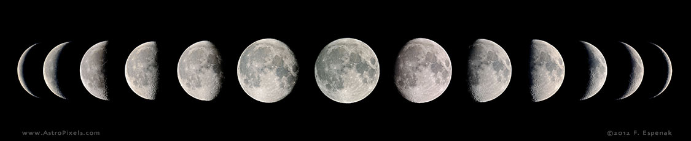

# Apollo Rumble
### NASA International Space Apps Challenge 2023
#### Make a Moonquake Map 2.0!

---

The Beyond, Up Close

---

Link to our completed project application: https://play.unity.com/mg/other/webgl_publisher_folder

Link to our slide show: https://docs.google.com/presentation/d/1tn16w-mocrxh67xqIhOOfXuaXtIadBTYSW6-yYRIzWg/edit#slide=id.g1c073d96ae2_2_35

Our project is an interactive map of seismic sensors and events on the surface of the moon. We used the C# language and Unity game engine to create a 3D model. 
Wrapping a height map provided by NASA around a sphere, we were able to reproduce an estimate of the texture and visual of the lunar surface. 
Using a .csv file, we converted and imported latitude and longitude data into Unity to mark the location of each of the Apollo sensors and seismic events. 

A user can interact with our map by selecting a year from a drop-down menu. This then displays the available sensor and seismic locations recorded in that year. 
Clicking and dragging the mouse allows for the rotation of the moon in order to interact with all displayed points. By clicking on a location, information related 
to the event is displayed. This information includes the date of occurrence or sensor number, magnitude, latitude and longitude, and a waveform which is the visual 
representation of the seismic event.

The user is then prompted to click on the moon to play an audio clip of what an adjusted waveform sounds like for that particular event. These auditory interpretations were generated using sac2wav, a C language project, to convert .sac files to a .wav format. As the audio clip plays, the moon shakes in proportion to the magnitude of the recorded activity at that location.

Our project presents lunar geolocation data in an intuitive and accessible manner. Our user interface design provides an immersive experience with control over the position of the moon, interactive information displays, and an auditory experience that encourages imagination of powerful physical phenomena.
